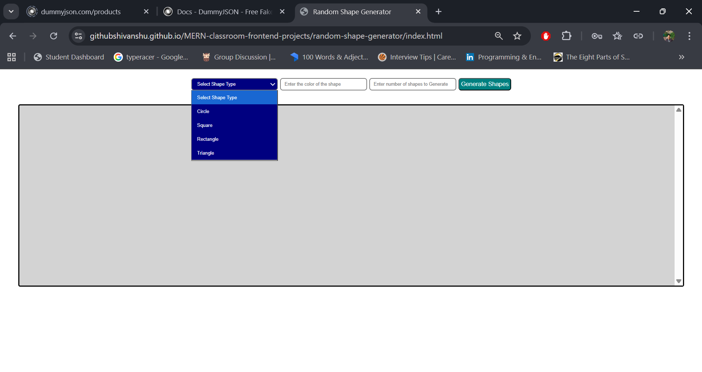
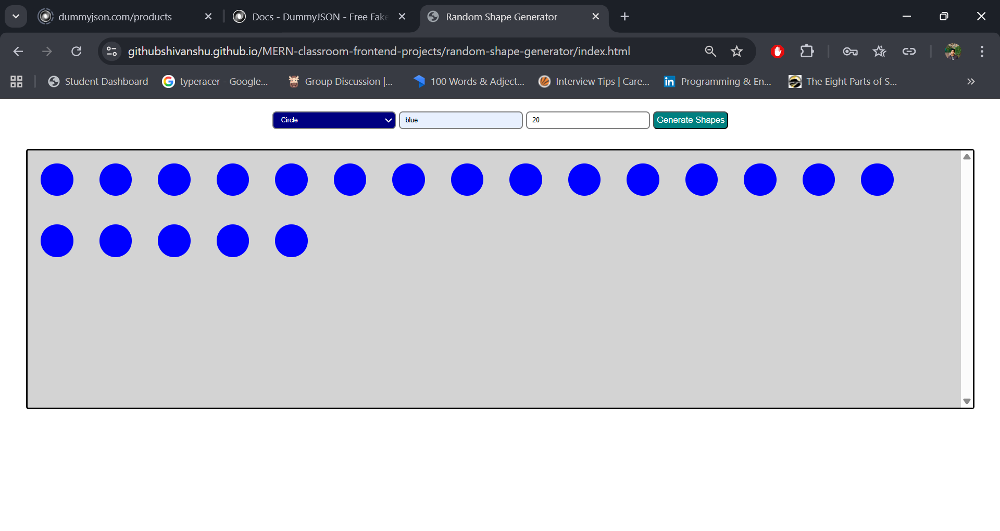
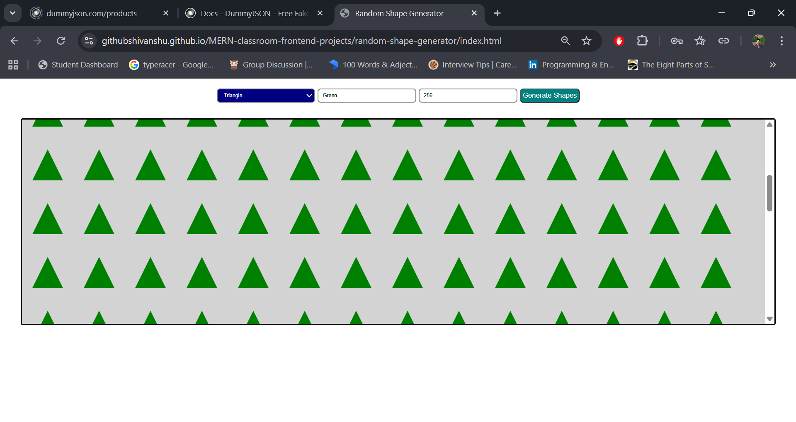

# Classroom Projects

This repository contains my frontend classroom practice projects built using **HTML, CSS, and JavaScript**.
### Tech Used
- HTML
- CSS
- JavaScript

## 🔗 Live Projects (GitHub Pages)

- **Random Shape Generator**  
  👉 https://githubshivanshu.github.io/MERN-classroom-frontend-projects/

## 🧠 Random Shape Generator
An interactive tool that dynamically generates shapes based on user input.
### Features
- Generates Circle, Square, Rectangle, Triangle
- Dynamic color selection
- DOM manipulation
- Clean separation of logic and styles

### Preview

---

More projects will be added as I progress.
